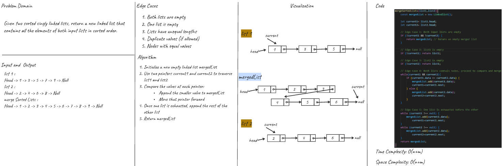
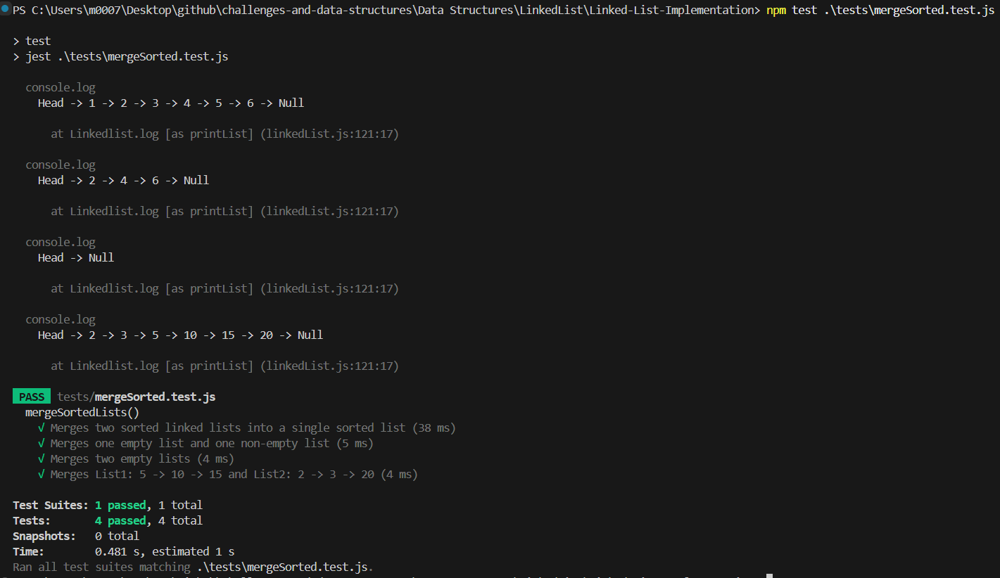

# Merge Sorted Linked Lists

## Challenge Summary

Write a method `mergeSortedLists(list1, list2)` inside the existing `Linkedlist` class that merges two **sorted** linked lists into a new sorted linked list.

---

## Problem Domain

Given two **sorted** singly linked lists, return a new linked list that contains all the elements of both input lists in **sorted** order.

---

## Inputs and Expected Outputs

| Input List 1            | Input List 2            | Expected Output                          |
|------------------------|------------------------|------------------------------------------|
| Head → 1 → 3 → 5 → Null | Head → 2 → 4 → 6 → Null | Head → 1 → 2 → 3 → 4 → 5 → 6 → Null       |
| Head → 5 → 10 → 15 → ∅  | Head → 2 → 3 → 20 → ∅   | Head → 2 → 3 → 5 → 10 → 15 → 20 → Null    |
| Head → ∅                | Head → ∅                | Head → Null                               |
| Head → ∅                | Head → 1 → 2 → Null     | Head → 1 → 2 → Null                        |

---

## Edge Cases

- One list is empty.
- Both lists are empty.
- Lists of unequal lengths.
- Duplicates (if allowed).
- Nodes with equal values.

---

## Algorithm

1. Initialize a new empty linked list `mergedList`.
2. Use two pointers `current1` and `current2` to traverse `list1` and `list2`.
3. Compare the `data` values:
   - Append the smaller node to `mergedList`.
   - Move that pointer forward.
4. Once one list is exhausted:
   - Append the remaining nodes from the other list.
5. Return the `mergedList`.

---

## Big O Complexity
- Time: **O(n+m)**
- Space: **O(n+m)** 

---

## Visual (Whiteboard)

---

## Console Output
 After running `app.js` in the console:  

