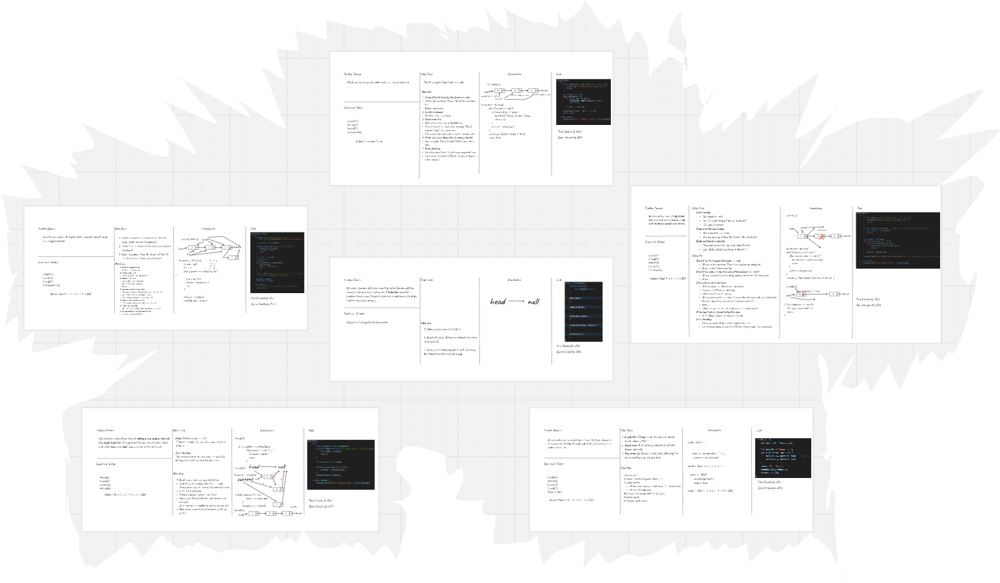
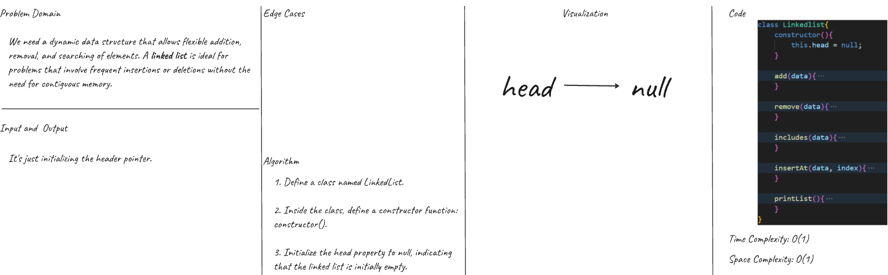
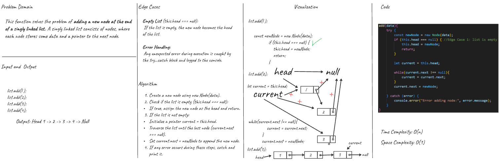
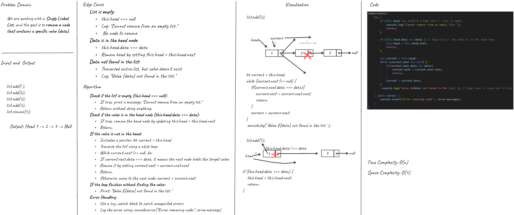
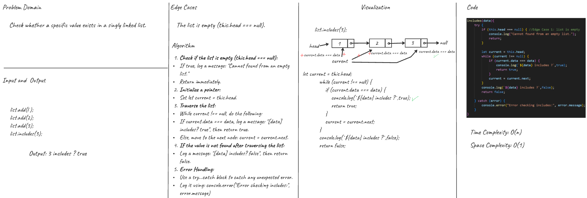
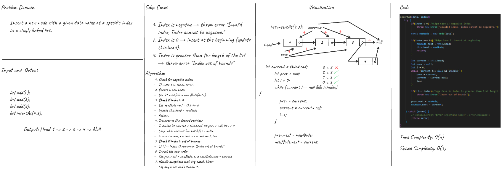
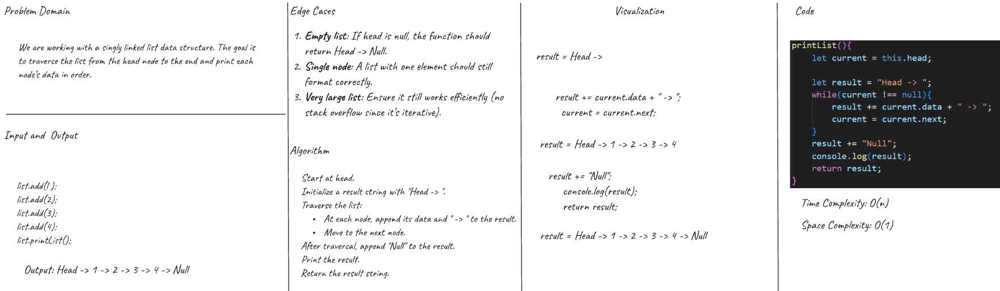
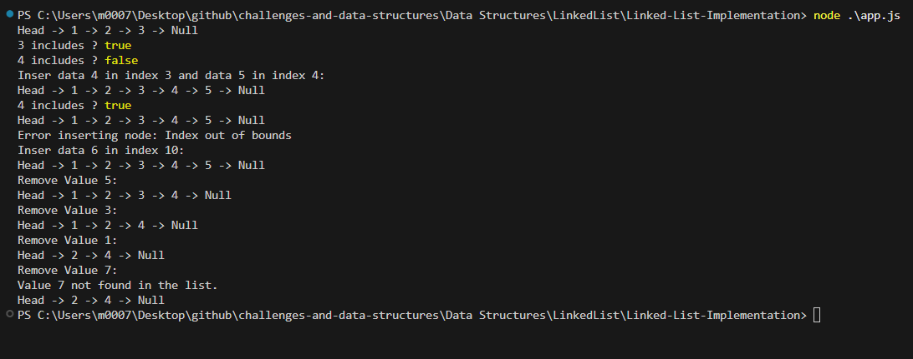
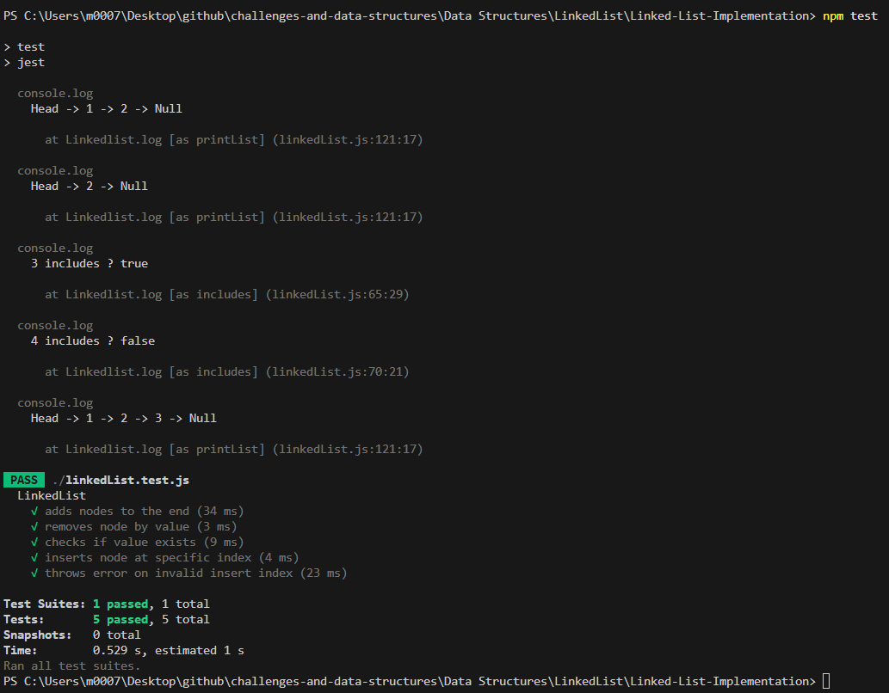

# Linked List Implementation

### Overview  

>Develop a singly linked list using JavaScript with full functionality and clear structure.

>- The `Node` class is responsible for storing individual values along with a reference to the next node in the list.  
>- The `LinkedList` class contains a `head` property that points to the beginning of the list.  
>- The `LinkedList` must implement the following operations:
> - `add(data)`: Add a new node carrying the provided data at the tail of the list.  
> - `remove(data)`: Remove the first node found with the given value.  
> - `printList()`: Output all node values from start to end in sequence.  
> - `includes(data)`: Return whether or not a node with the given value exists in the list.  
> - `insertAt(data, index)`: Insert a node with the given value at a specific position. Throws an error for invalid indices.

### Whiteboard Image
>LinkedListClass and Funcations

>LinkedList Class 

>Add function 

>Remove function

>Include function 

>InsertAt function 

>PrintList function

>Output 

>Output test 
