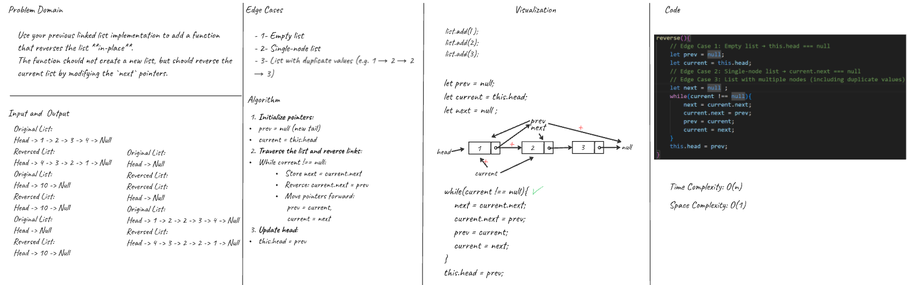
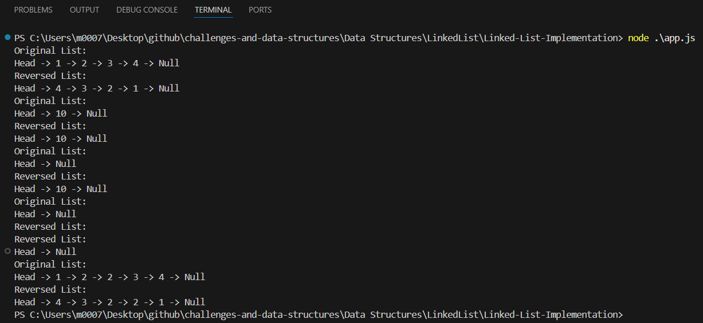

# Reverse Linked List

## Problem Domain
Use your previous linked list implementation to add a function that reverses the list **in-place**.  
The function should not create a new list, but should reverse the current list by modifying the `next` pointers.

---

## Inputs and Expected Outputs

### Example 1:
**Input:** Head → 1 → 2 → 3 → 4 → Null  
**Output:** Head → 4 → 3 → 2 → 1 → Null

### Example 2:
**Input:** Head → 10 → Null  
**Output:** Head → 10 → Null

### Example 3:
**Input:** Head → Null  
**Output:** Head → Null

### Example 3:
**Input:** Head -> 1 -> 2 -> 2 -> 3 -> 4 -> Null
**Output:** Head -> 4 -> 3 -> 2 -> 2 -> 1 -> Null

---

## Edge Cases
- 1- Empty list
- 2- Single-node list
- 3- List with duplicate values (e.g. 1 → 2 → 2 → 3)

---

## Algorithm
1. Start with 3 pointers: `prev = null`, `current = head`, `next = null`
2. Loop until `current` becomes null:
   - Save `next = current.next`
   - Set `current.next = prev`
   - Move `prev = current`
   - Move `current = next`
3. Set `head = prev`

---

## Big O Complexity
- Time: **O(n)**
- Space: **O(1)** — constant space, no extra memory used.

---

## Visual (Whiteboard)

---

## Console Output
 After running `app.js` in the console:  

