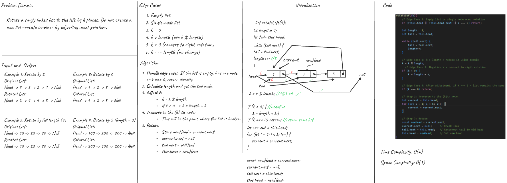
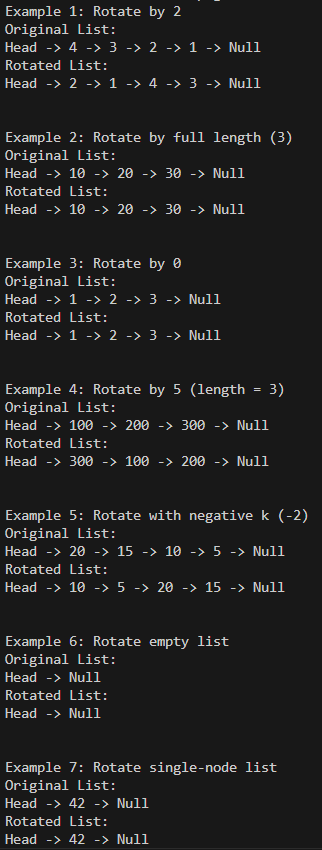
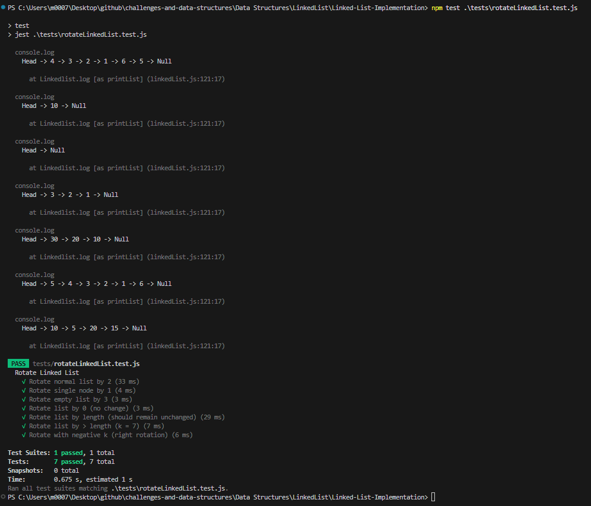

# Rotate Linked List Left

## Problem Domain
Add a method `rotateLeft(k)` to your Linked List implementation that rotates the list to the left by `k` positions. The rotation should happen **in-place**, without creating a new list.  
If `k` is negative, rotate to the **right** instead.  
If `k` is zero or a multiple of the list’s length, the list remains unchanged.

---

## Inputs and Expected Outputs

### Example 1:
**Input:** Head → 1 → 2 → 3 → 4 → 5 → Null, k = 2  
**Output:** Head → 3 → 4 → 5 → 1 → 2 → Null

### Example 2:
**Input:** Head → 10 → Null, k = 3  
**Output:** Head → 10 → Null

### Example 3:
**Input:** Head → Null, k = 1  
**Output:** Head → Null

### Example 4:
**Input:** Head → 1 → 2 → 3 → 4 → Null, k = -1  
**Output:** Head → 4 → 1 → 2 → 3 → Null

---

## Edge Cases
- Empty list
- Single-node list
- `k` is 0
- `k` is negative (convert to right rotation)
- `k` is greater than the list’s length (use `k % length`)
- `k` is a multiple of the list’s length (no change)

---

## Algorithm
1. Handle edge cases: empty list, single node, or `k === 0` → return as is.
2. Calculate the length of the list and get a reference to the tail.
3. Adjust `k` using modulo: `k = k % length`
4. If `k` is negative, convert to right rotation: `k = length + k`
5. If `k === 0`, return.
6. Traverse to the k-th node and break the list at that point.
7. Reconnect the old tail to the old head.
8. Set the new head to `k+1`-th node.

---

## Big O Complexity
- Time: **O(n)**
- Space: **O(1)** 

---

## Visual (Whiteboard)

---

## Console Output
 After running `app.js` in the console:  

---

## Console Output for Test
 After running `npm test rotateLinkedList.test.js` in the console:  
