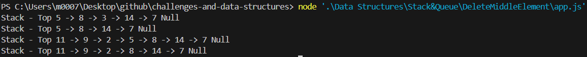

# Delete Middle Element of a Stack

## Problem Domain  

Implement a method `deleteMiddle()` to remove the middle element of a stack while maintaining the order of other elements.  

- If the stack size is **odd** → remove the middle element (index = size / 2).  
- If the stack size is **even** → remove the **lower middle element** (index = size / 2 - 1).  
- Handle edge cases like:  
  - **Empty stack** → return `"Cannot delete from an empty stack"`.  
  - **Stack with one element** → becomes empty after deletion.

---

### Whiteboard Images


---

### Sample Output

> Delete Middle Element of a Stack


---

### Test Results

> deleteMiddleStack.test.js 


---

### How to Run

```bash
npm install
npx jest
```