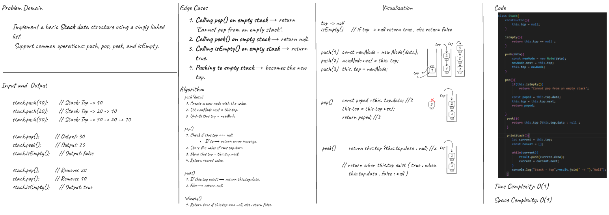
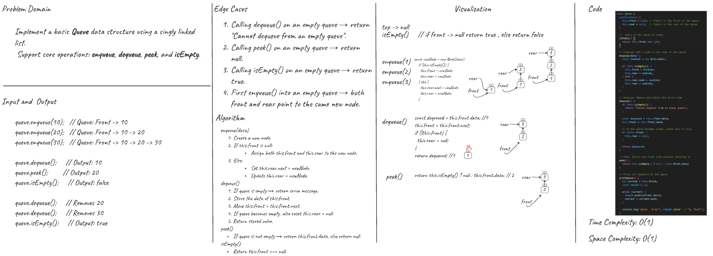
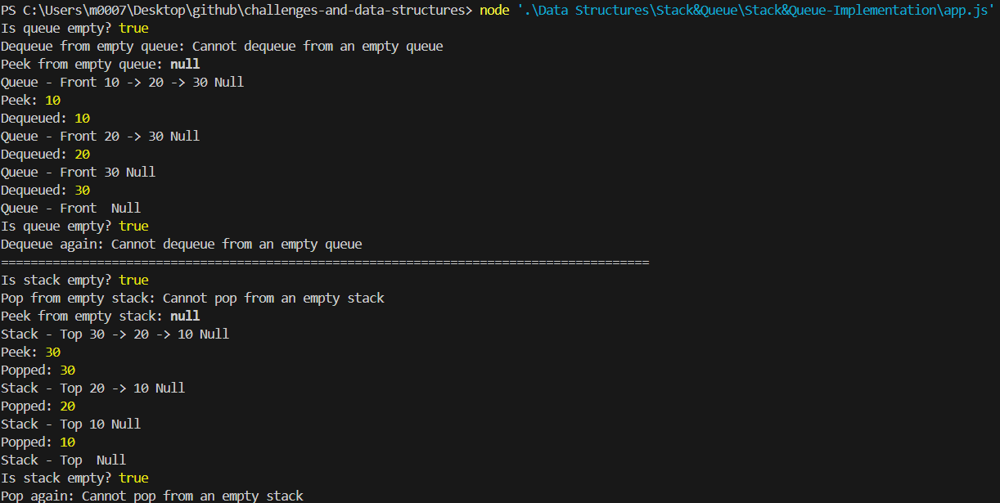
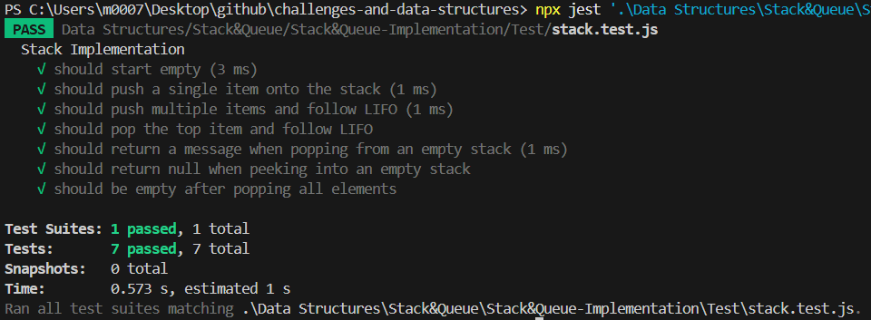
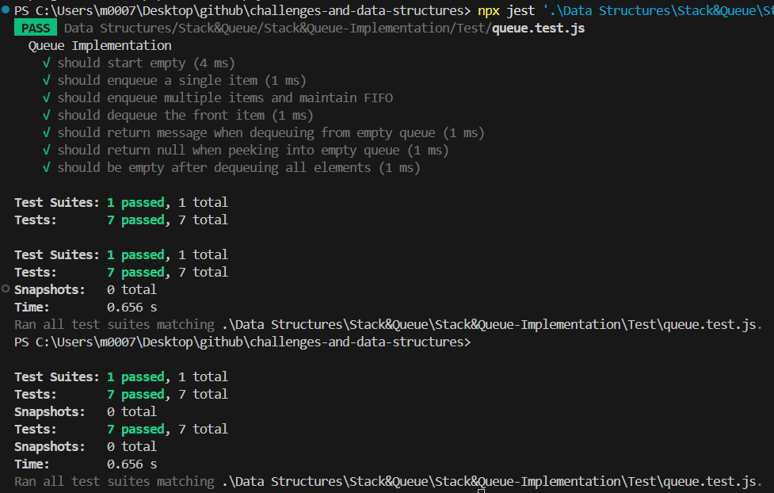

# Stack and Queue Implementation

### Overview

>Develop two fundamental data structures: **Stack** (LIFO) and **Queue** (FIFO) using JavaScript with clean structure and edge case handling.

- Each data structure uses a shared `Node` class which contains:
  - A `data` value
  - A `next` pointer

### Stack Class

- `push(data)`: Add a node with the given data to the top of the stack.
- `pop()`: Remove and return the top node.
- `peek()`: Return the top node without removing it.
- `isEmpty()`: Return `true` if the stack is empty.

### Queue Class

- `enqueue(data)`: Add a node with the given data to the end of the queue.
- `dequeue()`: Remove and return the front node.
- `peek()`: Return the front node without removing it.
- `isEmpty()`: Return `true` if the queue is empty.

---

### Whiteboard Images

>Stack and Queue Classes  




---

### Sample Output

> Stack & Queue -Output  

---

### Test Results

> stack.test.js  


> queue.test.js  


---

### Big O Complexity

| Operation  | Stack Time | Queue Time |
|------------|------------|-------------|
| push       | O(1)       | –           |
| pop        | O(1)       | –           |
| peek       | O(1)       | O(1)        |
| isEmpty    | O(1)       | O(1)        |
| enqueue    | –          | O(1)        |
| dequeue    | –          | O(1)        |

---

### Folder Structure

Stack&Queue-Implementation/
├── node.js
├── stack.js
├── queue.js
├── app.js
├── Test/
│   ├── stack.test.js
│   └── queue.test.js
├── docs/
│   ├── stack-test.png
│   ├── queue-test.png
│   └── ...
└── README.md 

### How to Run

```bash
npm install
npx jest
```