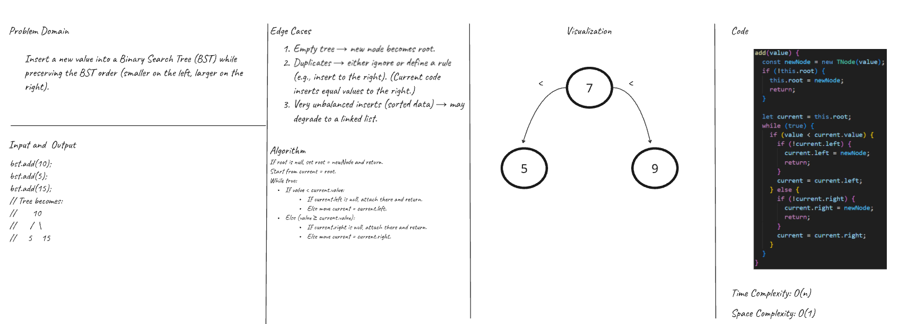
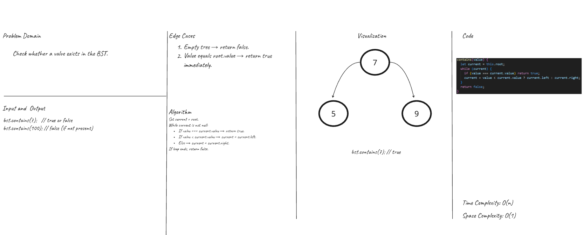
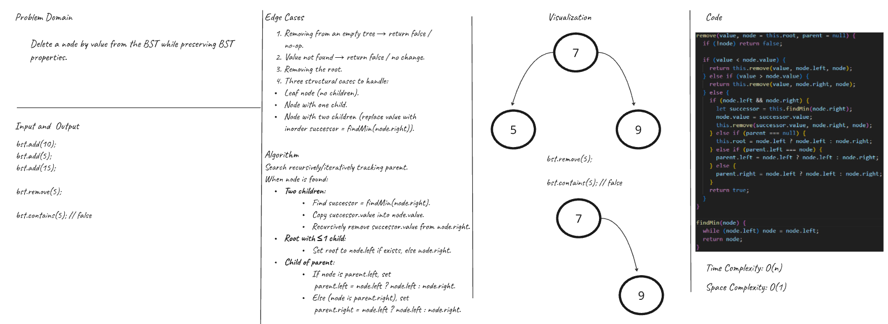
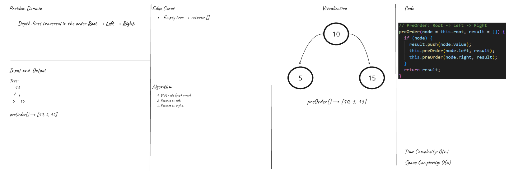
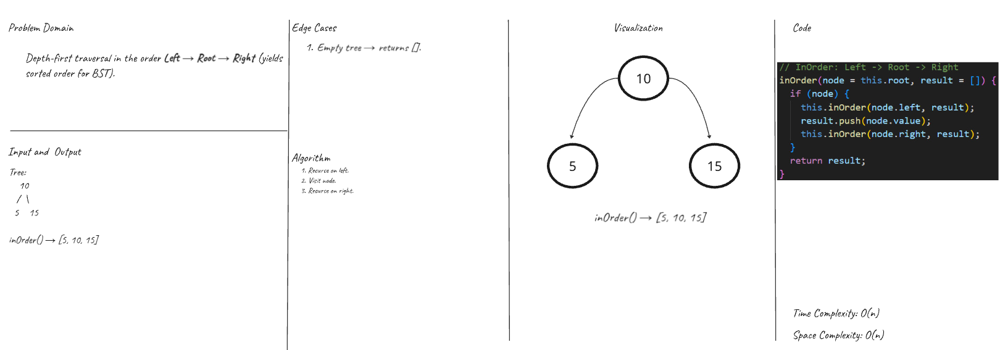
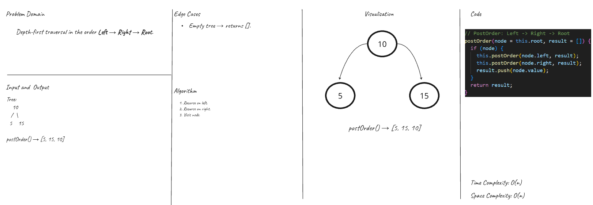
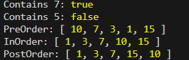

# Binary Search Tree Implementation  

### Overview  
> Develop a **Binary Search Tree (BST)** using JavaScript with full functionality and clear structure.  
>
> - The **Node** class is responsible for storing a value along with references to the left and right child nodes.  
> - The **BinarySearchTree** class manages the root node and provides tree operations.  
> - The BST must implement the following operations:  
>   - **add(data):** Insert a new node with the given value into the correct position in the BST.  
>   - **contains(data):** Return whether or not the tree contains a node with the specified value.  
>   - **remove(data):** Remove the node with the specified value while maintaining BST properties.  
>   - **findMin():** Return the smallest value in the BST.  
>   - **preOrder():** Traverse the tree in Pre-order (Root → Left → Right).  
>   - **inOrder():** Traverse the tree in In-order (Left → Root → Right).  
>   - **postOrder():** Traverse the tree in Post-order (Left → Right → Root).  

---

### Whiteboard Image  

> Add Function  
  

> Contains Function  
  

> Remove Function  
   

> Traversals - PreOrder, InOrder, PostOrder  

> Output  
  

---