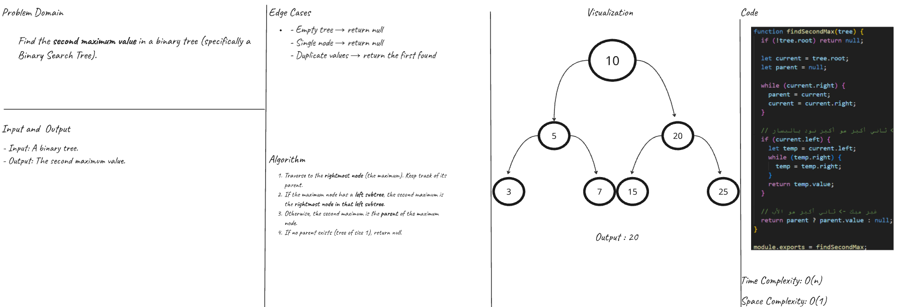

# Second Max Value (BST)

### Overview  
> Implement a function to return the **second maximum value** in a **Binary Search Tree (BST)**.  
>
> - **Input:** a BST with a root node.  
> - **Output:** the **second largest** value, or `null` if it doesn’t exist.  
> - **Notes:**  
>   - Empty tree → `null`  
>   - Single node → `null`  
>   - If max node has a left subtree → second max is the rightmost in that subtree  
>   - Otherwise → parent of max is the second max  

---

### Whiteboard Image  

> Second Maximum Value
  

