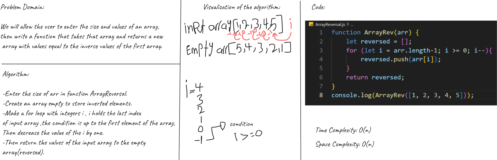
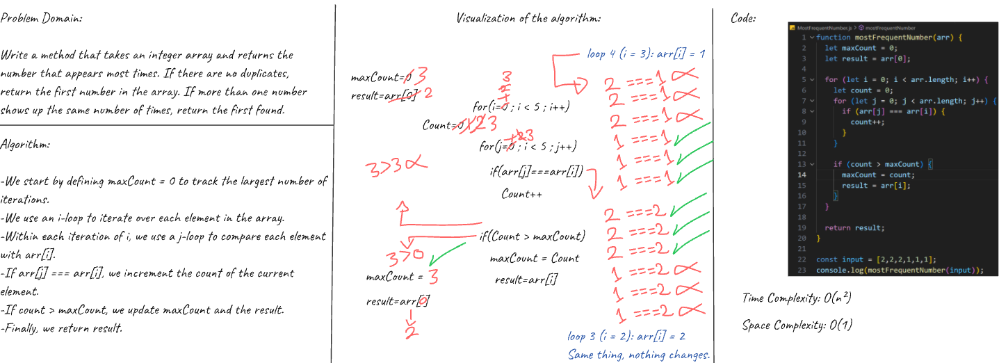
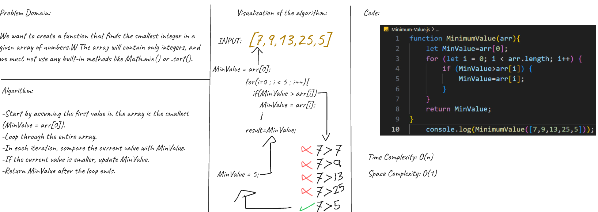
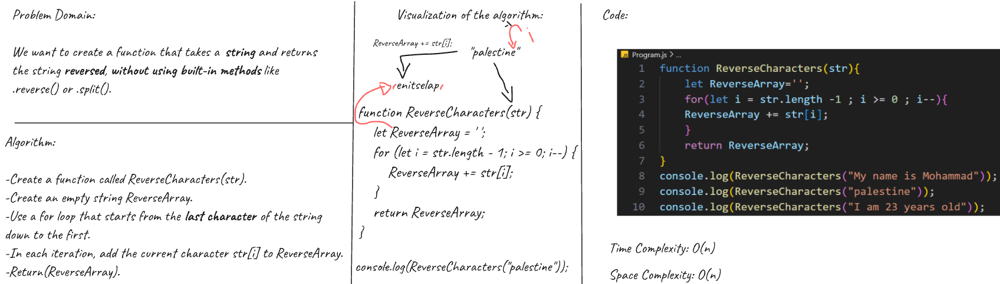
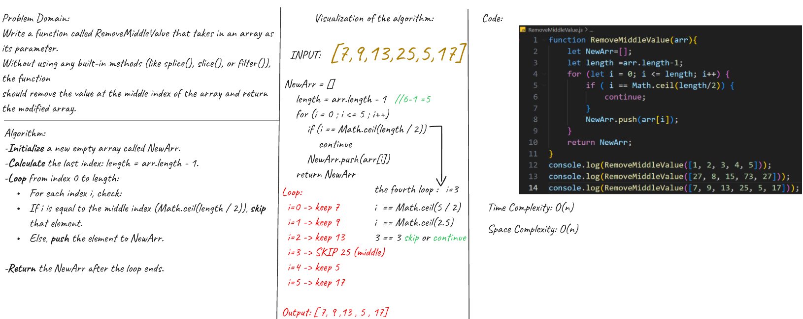

# Reversed Array Challenge
This code will take the number (the size of the array and the values ​​of the array), and then print the inverse values ​​of that array.

# Most Frequent Number Challenge
This code will take input from (size of the array and values of the array), 
then print the most frequent value in the array.

# Minimum Value Challenge
This code will take array(size of the array and values of the array), and print the minimum number in that array.

# Reverse Characters Challenge
This code will take the String (the size of the Characters and the values ​​of the Characters), and then print the inverse values ​​of that Characters.

# Remove Middle Value Challenge
This code will take an array (the size of the array and the values of the array), and remove the value at the middle index of that array.

